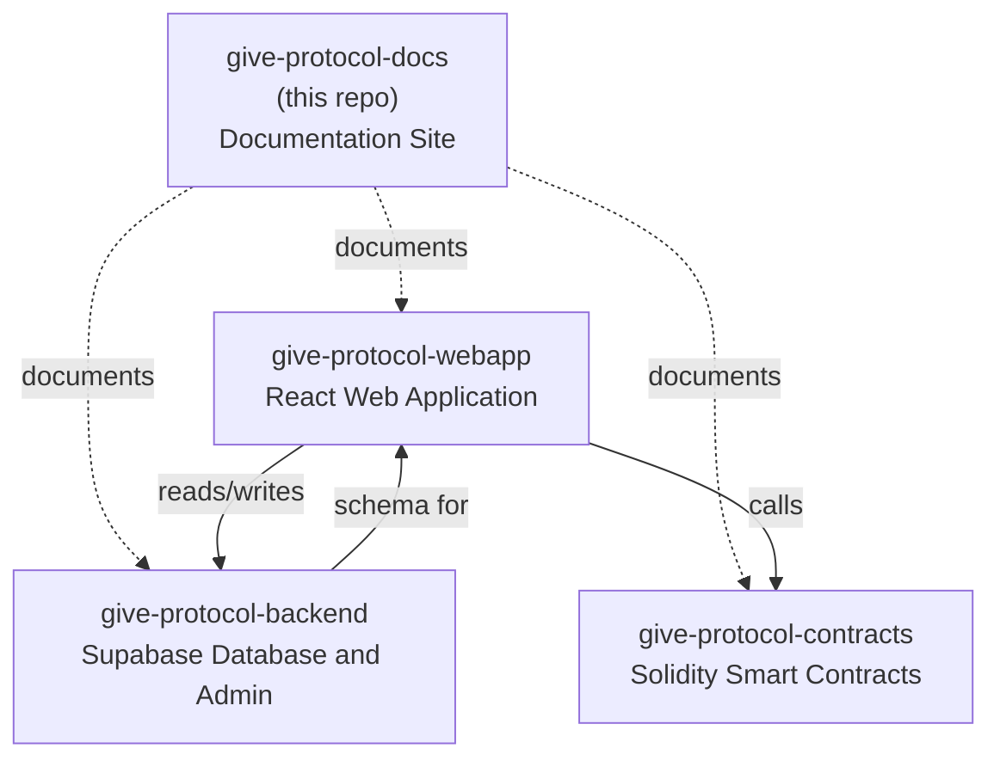

# Give Protocol Documentation

Central documentation hub for Give Protocol, a Delaware-based 501(c)(3) nonprofit building transparent, blockchain-based charitable giving infrastructure. This Jekyll site serves as the entry point for donors, organizations, volunteers, developers, and auditors seeking to understand the platform.

**Live site:** [docs.giveprotocol.io](https://docs.giveprotocol.io)

## Vision

Give Protocol exists to make charitable giving more transparent, efficient, and globally accessible. Every donation is recorded on-chain, every organization is verified, and every act of service is documented immutably. The platform reduces friction between donors and the causes they care about by combining blockchain infrastructure with a straightforward user experience.

The goal is not to replace traditional giving, but to provide an alternative channel where accountability is built into the system rather than layered on afterward. Donors see exactly where funds go. Organizations receive support with lower fees and faster settlement. Volunteers build verifiable service records. Auditors can inspect the full transaction history on public ledgers.

This documentation site is where that mission is explained, step by step, for every participant in the ecosystem.

## Repository Map

Give Protocol is built across four repositories. This docs site serves as the navigational starting point.



| Repository | Description | Link |
|------------|-------------|------|
| **give-protocol-docs** | Jekyll documentation site (this repo). User guides, technical reference, and platform overview. | [GitHub](https://github.com/GiveProtocol/give-protocol-docs) |
| **give-protocol-webapp** | React 18 + TypeScript progressive web app. Multi-chain wallet integration, fiat payments, donor/charity/volunteer portals. | [GitHub](https://github.com/GiveProtocol/give-protocol-webapp) |
| **give-protocol-backend** | Supabase PostgreSQL backend. 51 database migrations, RLS policies, admin dashboard, authentication services. | [GitHub](https://github.com/GiveProtocol/give-protocol-backend) |
| **give-protocol-contracts** | Solidity smart contracts on Hardhat. Donation processing, recurring distributions, portfolio funds, volunteer verification. Deployed on Moonbeam, Base, and Optimism networks. | [GitHub](https://github.com/GiveProtocol/give-protocol-contracts) |

## Documentation Structure

```
docs/
├── getting-started/        # Account creation, wallet setup, dashboard overview
├── donors/                 # Making donations, understanding CEFs, tracking impact
├── organizations/          # Verification, receiving funds, reporting, withdrawals
├── volunteers/             # Finding opportunities, time tracking, credentials
├── technical/              # Smart contracts, API docs, security model, tokens
├── support/                # Help center, popular articles, FAQ
└── troubleshooting/        # Account, wallet, donation, and error resolution

introduction/
├── what-is-give-protocol/  # Platform overview and mission
└── how-to-join/            # Onboarding for all user types

technical/
├── api-docs/               # API reference
├── blockchain-integration/ # Chain and wallet details
├── cryptocurrencies/       # Supported tokens
├── fees/                   # Fee structure explanation
└── smart-contracts/        # Contract documentation
```

## Local Development

### Prerequisites

- Ruby 3.1+
- Bundler
- Node.js (for search index generation)

### Setup

```bash
git clone https://github.com/GiveProtocol/give-protocol-docs.git
cd give-protocol-docs
bundle install
npm install
```

### Running Locally

```bash
bundle exec jekyll serve    # Starts at http://localhost:4000
```

### Building for Production

```bash
JEKYLL_ENV=production bundle exec jekyll build
```

The built site is output to `_site/`.

### Regenerating the Search Index

After adding or modifying documentation pages:

```bash
node generate-search.cjs
```

This scans all markdown files and generates `search.json` for the client-side search feature.

## Deployment

The site deploys automatically to GitHub Pages on push to `main`:

- **Workflow:** `.github/workflows/deploy.yml`
- **Build:** Ruby 3.1 + Jekyll 4.3
- **Target:** `gh-pages` branch (force orphan)
- **Domain:** docs.giveprotocol.io (via CNAME)

No manual deployment is required for normal content updates.

## Translation

Documentation is available in three primary languages with full translations, plus eight secondary languages via Google Translate:

**Primary (full translation):**
- English (default)
- Spanish (`/es/`)
- Chinese Simplified (`/zh/`)

**Secondary (Google Translate widget):**
- German, French, Japanese, Portuguese, Korean, Arabic, Hindi

### Adding a New Language

1. Create a language directory (e.g., `/fr/`)
2. Copy the English documentation structure into it
3. Translate the content files
4. Add the language entry to `_data/languages.yml`
5. Update `_config.yml` with the new language defaults

## Contributing

Contributions to documentation are welcome, particularly for translations and content improvements.

### Adding New Pages

1. Create a `.md` file in the appropriate `docs/` subdirectory
2. Add YAML front matter:
   ```yaml
   ---
   title: Your Page Title
   description: Brief description for SEO
   permalink: /docs/section/your-page/
   ---
   ```
3. Write content in Markdown (kramdown with GFM support)
4. Test locally with `bundle exec jekyll serve`
5. Regenerate search index: `node generate-search.cjs`
6. Commit and push (deployment is automatic)

### Writing Guidelines

- Use clear, direct language. Avoid jargon where a simpler term exists.
- Include code examples for developer-facing content.
- Add screenshots or diagrams for UI-related documentation.
- Keep the navigation hierarchy shallow (three levels maximum).
- Cross-reference related pages using relative URLs.

See `guides/documentation-guidelines.md` for the full style guide.

### Reusable Components

The site provides Jekyll includes for consistent formatting:

| Include | Purpose |
|---------|---------|
| `callout.html` | Alert and info boxes |
| `steps.html` | Step-by-step guides |
| `toc.html` | Table of contents |
| `feedback.html` | Page feedback widget |
| `read-time.html` | Reading time estimate |
| `related.html` | Related articles links |

## Tech Stack

| Component | Technology |
|-----------|-----------|
| Static site generator | Jekyll 4.3 |
| Markup | Markdown (kramdown + GFM) |
| Syntax highlighting | Rouge |
| Search | simple-jekyll-search (client-side) |
| Styling | Custom SCSS (Tailwind-inspired) |
| Icons | Font Awesome (CDN) |
| Fonts | Inter (Google Fonts) |
| SEO | jekyll-seo-tag, jekyll-sitemap |
| Deployment | GitHub Pages via Actions |
| Domain | docs.giveprotocol.io |

## Project Structure

```
give-protocol-docs/
├── _config.yml              # Jekyll configuration
├── _config.production.yml   # Production overrides
├── _layouts/                # HTML templates (modern, article, default)
├── _includes/               # Reusable components
├── _data/                   # Navigation, languages, translations
├── _sass/                   # SCSS stylesheets
├── assets/                  # CSS, JavaScript, images
├── docs/                    # Main documentation content
├── introduction/            # Overview and onboarding
├── getting-started/         # Quick start guides
├── technical/               # Developer reference
├── es/ & zh/                # Translated content
├── guides/                  # Internal contributor guides
├── generate-search.cjs      # Search index generator
├── search.json              # Generated search index
├── CNAME                    # Custom domain configuration
├── Gemfile                  # Ruby dependencies
└── .github/workflows/
    └── deploy.yml           # GitHub Pages deployment
```

## License

UNLICENSED -- Private Repository
