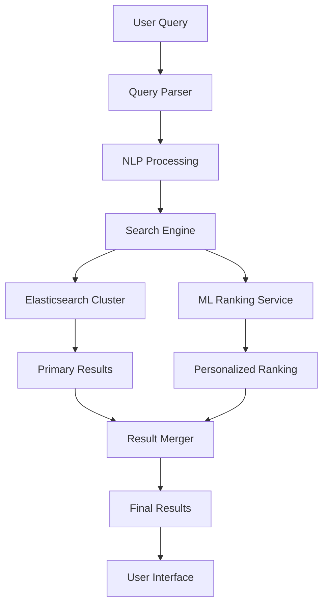

This comprehensive guide covers Give Protocol's advanced search and discovery features, helping users find relevant organizations, campaigns, and volunteer opportunities efficiently.

## Overview

Give Protocol's search and discovery system uses advanced algorithms, machine learning, and user behavior analysis to connect donors with causes they care about and match volunteers with meaningful opportunities.

### Key Features

- **Intelligent Search**: Natural language processing and semantic understanding
- **Personalized Recommendations**: AI-driven matching based on interests and history
- **Advanced Filtering**: Multi-dimensional filtering and sorting options
- **Real-time Results**: Instant search with dynamic updates
- **Cross-entity Search**: Find organizations, campaigns, and opportunities in one search

## Search Architecture

### Search Infrastructure



### Technology Stack

- **Search Engine**: Elasticsearch 8.x
- **NLP Processing**: spaCy and BERT models
- **Recommendation Engine**: TensorFlow-based collaborative filtering
- **Caching Layer**: Redis for frequent queries
- **Analytics**: Apache Spark for behavior analysis

## Search Functionality

### Basic Search

**Query Types Supported:**

- Simple keyword search
- Phrase matching with quotes
- Boolean operators (AND, OR, NOT)
- Wildcards and fuzzy matching
- Geographic search

**Example Queries:**

```
education "New York"
environmental AND conservation
volunteer opportunities near me
crypto-friendly charities
disaster relief -administrative
```

### Advanced Search

**Search Syntax:**

```
field:value AND (field2:value2 OR field3:value3) NOT field4:value4
```

**Searchable Fields:**

- `name`: Organization or campaign name
- `category`: Cause category
- `location`: Geographic location
- `tags`: Associated tags
- `description`: Full-text description
- `ein`: Tax ID number (organizations)
- `verified`: Verification status

### Natural Language Processing

**Understanding Intent:**

```javascript
// Query: "I want to help children in Africa with education"
{
  intent: "donate",
  cause: "education",
  beneficiary: "children",
  location: "Africa",
  sentiment: "positive"
}
```

**Synonym Expansion:**

- "kids" → "children", "youth", "minors"
- "help" → "support", "assist", "aid"
- "education" → "schools", "learning", "literacy"

## Discovery Features

### Personalized Recommendations

**Recommendation Algorithm:**

```python
def get_recommendations(user_id, context):
    # Collaborative filtering
    similar_users = find_similar_users(user_id)
    cf_recommendations = aggregate_preferences(similar_users)

    # Content-based filtering
    user_interests = get_user_interests(user_id)
    cb_recommendations = match_content(user_interests)

    # Hybrid approach
    recommendations = merge_recommendations(
        cf_recommendations,
        cb_recommendations,
        weights={'cf': 0.6, 'cb': 0.4}
    )

    # Context adjustment
    return adjust_for_context(recommendations, context)
```

### Trending Discoveries

**Trend Calculation:**

- Recent donation velocity
- Social media mentions
- News coverage
- Seasonal relevance
- Emergency response needs

**Categories:**

- Trending Now
- Rising Stars
- Seasonal Causes
- Emergency Appeals
- Local Highlights

### Geographic Discovery

**Location-Based Features:**

- Automatic location detection
- Radius-based search
- Regional cause mapping
- Local volunteer opportunities
- Community impact visualization

**Map Integration:**

```javascript
// Initialize map view
const mapView = new GiveProtocolMap({
  center: userLocation,
  zoom: 12,
  layers: ["organizations", "opportunities", "events"],
});

// Add search results to map
mapView.addResults(searchResults, {
  clustering: true,
  heatmap: true,
  filters: activeFilters,
});
```

## Filter System

### Category Filters

**Primary Categories:**

- Animals & Wildlife
- Arts & Culture
- Community Development
- Disaster Relief
- Education
- Environment
- Health & Medicine
- Human Rights
- International Aid
- Religion & Spirituality

**Sub-category Examples:**

```json
{
  "Education": [
    "Early Childhood",
    "K-12 Schools",
    "Higher Education",
    "Adult Literacy",
    "STEM Programs",
    "Special Education"
  ]
}
```

### Advanced Filters

**Organization Filters:**

- Verification level
- Tax-deductible status
- Size (budget/staff)
- Years active
- Transparency rating
- Payment methods accepted

**Campaign Filters:**

- Funding goal range
- Deadline
- Matching funds available
- Progress percentage
- Update frequency

**Volunteer Filters:**

- Time commitment
- Skill requirements
- Virtual/in-person
- Background check required
- Age restrictions
- Accessibility

### Dynamic Filtering

```javascript
// Real-time filter updates
const filterManager = new FilterManager({
  onChange: (filters) => {
    // Update results without page reload
    searchAPI.updateResults(filters);

    // Update URL for sharing
    updateURLParams(filters);

    // Track filter usage
    analytics.track("filter_applied", filters);
  },
});

// Smart filter suggestions
filterManager.suggestFilters(searchResults);
```

## Ranking Algorithm

### Relevance Scoring

**Factors Considered:**

1. **Text Relevance** (30%)

   - Title matches
   - Description relevance
   - Tag alignment

2. **User Behavior** (25%)

   - Click-through rate
   - Conversion rate
   - Dwell time

3. **Entity Quality** (20%)

   - Verification status
   - Completeness score
   - Update recency

4. **Social Signals** (15%)

   - User ratings
   - Social shares
   - Testimonials

5. **Personalization** (10%)
   - User history
   - Preference matching
   - Behavioral patterns

### Machine Learning Model

```python
# Ranking model architecture
model = tf.keras.Sequential([
    tf.keras.layers.Dense(128, activation='relu'),
    tf.keras.layers.Dropout(0.2),
    tf.keras.layers.Dense(64, activation='relu'),
    tf.keras.layers.Dense(32, activation='relu'),
    tf.keras.layers.Dense(1, activation='sigmoid')
])

# Features include:
# - Query-document similarity
# - User engagement metrics
# - Entity characteristics
# - Temporal factors
# - User-entity affinity
```

## Search API

### Basic Search Endpoint

```http
GET /api/v1/search
```

**Parameters:**

- `q` (required): Search query
- `type`: Entity type (organization, campaign, opportunity)
- `category`: Filter by category
- `location`: Geographic filter
- `radius`: Distance in miles
- `verified`: Verification status
- `sort`: Sorting option
- `page`: Page number
- `limit`: Results per page

**Example Request:**

```http
GET /api/v1/search?q=education&type=organization&location=NYC&radius=50&verified=true&sort=relevance&page=1&limit=20
```

### Advanced Search Endpoint

```http
POST /api/v1/search/advanced
Content-Type: application/json

{
  "query": {
    "must": [
      { "match": { "description": "education" } }
    ],
    "should": [
      { "match": { "tags": "STEM" } }
    ],
    "filter": [
      { "range": { "founded": { "gte": "2010" } } },
      { "term": { "verified": true } }
    ]
  },
  "sort": [
    { "_score": "desc" },
    { "rating": "desc" }
  ],
  "aggs": {
    "categories": {
      "terms": { "field": "category" }
    }
  }
}
```

### Autocomplete Endpoint

```http
GET /api/v1/search/autocomplete?q=educ

Response:
{
  "suggestions": [
    {
      "text": "education",
      "type": "category",
      "count": 1234
    },
    {
      "text": "Education First Foundation",
      "type": "organization",
      "id": "org_123"
    }
  ]
}
```

## User Interface Components

### Search Bar

```html
<!-- Advanced search bar component -->
<div class="search-container">
  <input
    type="text"
    id="search-input"
    placeholder="Search causes, organizations, or opportunities..."
    autocomplete="off"
  />
  <div class="search-filters">
    <button class="filter-btn" data-filter="location">
      <i class="icon-location"></i> Near me
    </button>
    <button class="filter-btn" data-filter="verified">
      <i class="icon-verified"></i> Verified only
    </button>
  </div>
  <div id="search-suggestions" class="suggestions-dropdown"></div>
</div>
```

### Result Display

```javascript
// Result card component
const ResultCard = ({ result }) => (
  <div className="result-card">
    <div className="result-header">
      
      <div className="result-title">
        <h3>{result.name}</h3>
        {result.verified && <VerifiedBadge />}
      </div>
    </div>
    <p className="result-description">
      {highlightMatches(result.description, searchQuery)}
    </p>
    <div className="result-meta">
      <span className="category">{result.category}</span>
      <span className="location">{result.location}</span>
      <span className="rating">★ {result.rating}</span>
    </div>
    <div className="result-actions">
      <button onClick={() => viewDetails(result.id)}>Learn More</button>
      <button onClick={() => quickDonate(result.id)}>Donate Now</button>
    </div>
  </div>
);
```

### Filter Interface

```javascript
// Dynamic filter component
const FilterPanel = ({ availableFilters, onFilterChange }) => {
  const [activeFilters, setActiveFilters] = useState({});

  const handleFilterChange = (filterType, value) => {
    const newFilters = {
      ...activeFilters,
      [filterType]: value,
    };
    setActiveFilters(newFilters);
    onFilterChange(newFilters);
  };

  return (
    <div className="filter-panel">
      {Object.entries(availableFilters).map(([type, options]) => (
        <FilterGroup
          key={type}
          type={type}
          options={options}
          selected={activeFilters[type]}
          onChange={(value) => handleFilterChange(type, value)}
        />
      ))}
    </div>
  );
};
```

## Search Analytics

### Tracking Implementation

```javascript
// Search analytics tracking
const searchAnalytics = {
  trackSearch: (query, filters, results) => {
    gtag("event", "search", {
      search_term: query,
      filters_used: Object.keys(filters),
      results_count: results.length,
      has_results: results.length > 0,
    });
  },

  trackClick: (result, position) => {
    gtag("event", "search_result_click", {
      result_id: result.id,
      result_type: result.type,
      position: position,
      search_query: currentQuery,
    });
  },

  trackConversion: (result, action) => {
    gtag("event", "search_conversion", {
      result_id: result.id,
      action: action, // 'donate', 'volunteer', 'share'
      value: result.amount || 0,
    });
  },
};
```

### Performance Metrics

**Key Metrics:**

- Average search latency
- Click-through rate by position
- Conversion rate by query type
- Zero-result rate
- Query refinement rate

**Dashboard Example:**

```sql
-- Top performing searches
SELECT
  query,
  COUNT(*) as search_count,
  AVG(click_through_rate) as avg_ctr,
  AVG(conversion_rate) as avg_conversion
FROM search_analytics
WHERE date >= CURRENT_DATE - INTERVAL '30 days'
GROUP BY query
ORDER BY search_count DESC
LIMIT 100;
```

## Mobile Search Experience

### Touch-Optimized Interface

```javascript
// Mobile search optimizations
const mobileSearch = {
  init: () => {
    // Voice search
    if ("webkitSpeechRecognition" in window) {
      enableVoiceSearch();
    }

    // Location-based search
    if ("geolocation" in navigator) {
      enableLocationSearch();
    }

    // Infinite scroll
    enableInfiniteScroll({
      threshold: 100,
      loadMore: loadNextPage,
    });
  },
};
```

### Offline Capabilities

```javascript
// Service worker for offline search
self.addEventListener("fetch", (event) => {
  if (event.request.url.includes("/api/search")) {
    event.respondWith(
      caches
        .match(event.request)
        .then((response) => response || fetch(event.request))
        .catch(() => caches.match("/offline-search")),
    );
  }
});
```

## SEO Optimization

### Search Results Pages

```html
<!-- SEO-friendly search results -->
<div itemscope itemtype="http://schema.org/SearchResultsPage">
  <h1>Search Results for "education"</h1>
  <meta itemprop="about" content="education charities" />
  <div itemprop="mainEntity" itemscope itemtype="http://schema.org/ItemList">
    <link
      itemprop="itemListOrder"
      href="http://schema.org/ItemListOrderDescending"
    />
    <meta itemprop="numberOfItems" content="50" />
    <!-- Individual results -->
  </div>
</div>
```

### Structured Data

```json
{
  "@context": "https://schema.org",
  "@type": "SearchAction",
  "target": {
    "@type": "EntryPoint",
    "urlTemplate": "https://give.io/search?q={search_term}"
  },
  "query-input": "required name=search_term"
}
```

## Best Practices

### For Users

1. **Effective Searching**

   - Use specific keywords
   - Apply relevant filters
   - Try different search terms
   - Use location filters for local results

2. **Discovery Tips**
   - Explore trending causes
   - Check recommendations
   - Save searches for updates
   - Follow favorite organizations

### For Organizations

1. **Optimization**

   - Complete all profile fields
   - Use relevant keywords
   - Update content regularly
   - Add high-quality images

2. **Visibility**
   - Maintain verification
   - Encourage reviews
   - Share updates
   - Engage with supporters

### For Developers

1. **Integration**

   - Cache frequent searches
   - Implement pagination properly
   - Handle errors gracefully
   - Monitor API usage

2. **Performance**
   - Debounce search input
   - Lazy load images
   - Use search analytics
   - Optimize for mobile

## Future Enhancements

### Planned Features

- Visual search capabilities
- Multi-language support
- AI-powered chat search
- Augmented reality discovery
- Blockchain-verified results

### Research Areas

- Semantic search improvements
- Federated search across platforms
- Predictive search suggestions
- Context-aware recommendations
- Privacy-preserving personalization
