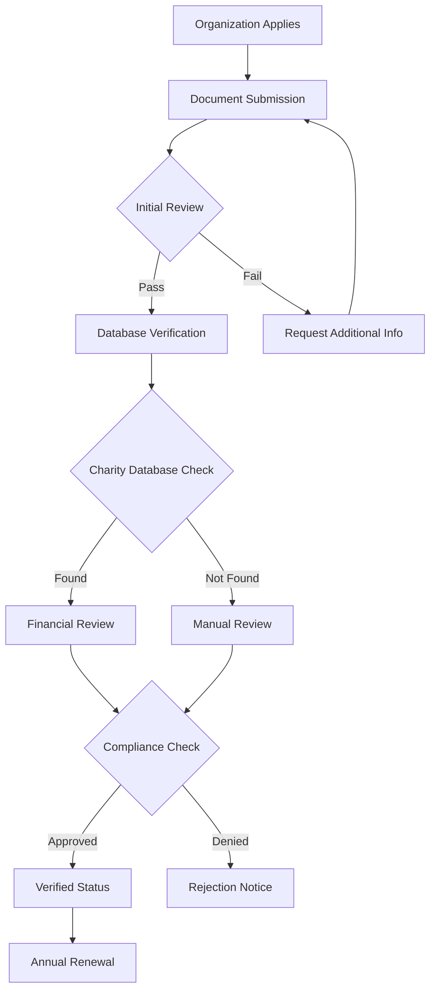

This document provides detailed information about Give Protocol's multi-tier verification system, which ensures trust, transparency, and security across the platform.

## Overview

Give Protocol's verification system establishes trust between donors, organizations, and volunteers through comprehensive identity validation, document verification, and ongoing compliance monitoring.

### Verification Benefits

- **For Organizations**: Increased donor trust and higher donation rates
- **For Donors**: Confidence in legitimate charitable giving
- **For Volunteers**: Safe and verified opportunities
- **For the Platform**: Reduced fraud and enhanced reputation

## Verification Levels

### Basic Verification

**Requirements:**

- Email confirmation
- Phone number verification
- Basic profile completion
- Terms of service acceptance

**Features Unlocked:**

- Create and browse listings
- Send and receive messages
- Basic platform access
- Limited transaction amounts

### Standard Verification

**Requirements:**

- Government-issued ID
- Address verification
- Social media linking
- Background check consent

**Features Unlocked:**

- Full platform features
- Higher transaction limits
- Priority support
- Verification badge display

### Enhanced Verification

**Requirements:**

- Video verification call
- Professional references
- Financial documentation
- Extended background check

**Features Unlocked:**

- Premium features access
- Unlimited transactions
- API access
- Custom integrations

## Organization Verification

### Nonprofit Status Verification

**Required Documents:**

1. **Tax-Exempt Status**

   - IRS 501(c)(3) determination letter (US)
   - Charity registration (International)
   - Current tax-exempt certificate

2. **Governance Documents**

   - Articles of incorporation
   - Bylaws
   - Board of directors list
   - Conflict of interest policy

3. **Financial Documentation**
   - Recent Form 990 (US)
   - Audited financial statements
   - Annual report
   - Budget documentation

### Verification Process



### Verification Timeline

- **Initial Application**: 1-2 business days
- **Document Review**: 3-5 business days
- **Database Verification**: Automated
- **Final Approval**: 7-10 business days total

### International Organizations

**Additional Requirements:**

- Country-specific charity registration
- Translated documents (certified)
- International banking verification
- Local compliance certificates

**Supported Countries:**

- United States
- Canada
- United Kingdom
- Australia
- European Union members
- Additional countries evaluated case-by-case

## Donor Verification

### Identity Verification

**Standard KYC Process:**

1. **Document Upload**

   - Government-issued photo ID
   - Selfie with ID
   - Proof of address

2. **Automated Checks**

   - Document authenticity
   - Facial recognition matching
   - Address validation
   - Sanctions screening

3. **Risk Assessment**
   - Transaction history analysis
   - Behavioral patterns
   - Geographic risk factors
   - PEP screening

### Verification Tiers

**Tier 1 - Basic ($0-$1,000/year)**

- Email verification only
- No documentation required
- Anonymous donations allowed

**Tier 2 - Standard ($1,001-$10,000/year)**

- ID verification required
- Address confirmation
- Source of funds declaration

**Tier 3 - Enhanced ($10,001+/year)**

- Enhanced due diligence
- Wealth verification
- Ongoing monitoring
- Dedicated support

### Privacy Protection

**Data Handling:**

- End-to-end encryption
- Minimal data retention
- GDPR/CCPA compliant
- Right to deletion

**Anonymity Options:**

- Anonymous donations under thresholds
- Pseudonymous giving
- Private donor advised funds
- Blockchain-based privacy

## Volunteer Verification

### Background Checks

**Standard Screening:**

- Identity verification
- Criminal background check
- Sex offender registry
- Reference checks

**Enhanced Screening (for sensitive roles):**

- FBI fingerprinting
- Child abuse clearances
- Professional license verification
- Drug screening (if required)

### Skills Verification

**Professional Skills:**

- License verification
- Certification validation
- Portfolio review
- Skill assessments

**Verification Partners:**

- Sterling background checks
- Checkr integration
- Professional boards
- Educational institutions

## Technical Implementation

### Verification API

**Initiate Verification:**

```http
POST /api/v1/verification/initiate
Authorization: Bearer your_api_key
Content-Type: application/json

{
  "entity_type": "organization",
  "entity_id": "org_123abc",
  "verification_level": "standard",
  "documents": [
    {
      "type": "501c3_letter",
      "url": "https://secure.give.io/docs/..."
    }
  ]
}
```

**Check Status:**

```http
GET /api/v1/verification/status/{entity_id}
Authorization: Bearer your_api_key

Response:
{
  "entity_id": "org_123abc",
  "status": "in_review",
  "level": "standard",
  "checks": {
    "identity": "completed",
    "documents": "in_review",
    "database": "pending"
  },
  "estimated_completion": "2024-01-20T10:00:00Z"
}
```

### Webhook Events

**Verification Events:**

```javascript
// Verification completed
{
  "event": "verification.completed",
  "data": {
    "entity_id": "org_123abc",
    "entity_type": "organization",
    "level": "standard",
    "status": "approved",
    "expires_at": "2025-01-15T00:00:00Z"
  }
}

// Verification failed
{
  "event": "verification.failed",
  "data": {
    "entity_id": "org_123abc",
    "reason": "Invalid documentation",
    "required_actions": [
      "Submit updated 501c3 letter",
      "Provide board resolution"
    ]
  }
}
```

### SDK Integration

**JavaScript Example:**

```javascript
import { Verification } from "@give-protocol/sdk";

const verification = new Verification({
  apiKey: "your_api_key",
});

// Start organization verification
const result = await verification.initiate({
  entityType: "organization",
  entityId: "org_123",
  documents: [
    { type: "501c3", file: file1 },
    { type: "board_list", file: file2 },
  ],
});

// Monitor progress
const status = await verification.getStatus("org_123");
console.log(`Verification ${status.complete ? "completed" : "in progress"}`);
```

## Verification Standards

### Document Requirements

**Acceptable Formats:**

- PDF (preferred)
- JPG/PNG (for IDs)
- DOC/DOCX (for letters)
- Maximum file size: 10MB

**Document Quality:**

- Clear and legible
- Complete documents only
- Recent dates (within 12 months)
- Official letterhead required

### Compliance Framework

**Regulatory Compliance:**

- FinCEN guidelines
- OFAC screening
- State regulations
- International standards

**Industry Standards:**

- FATF recommendations
- ISO 27001 certification
- SOC 2 Type II compliance
- PCI DSS for payments

## Verification Maintenance

### Renewal Requirements

**Annual Review:**

- Updated documentation
- Continued compliance
- Activity verification
- Fee payment (if applicable)

**Triggers for Re-verification:**

- Change in leadership
- Address changes
- Suspicious activity
- Regulatory updates

### Verification Revocation

**Grounds for Revocation:**

- Fraudulent documentation
- Criminal activity
- Terms of service violations
- Regulatory non-compliance

**Revocation Process:**

1. Notice of concern
2. Opportunity to remedy
3. Final determination
4. Appeal process

## Trust Indicators

### Verification Badges

**Badge Types:**

- Basic Verified ✓
- Standard Verified ✓✓
- Enhanced Verified ✓✓✓
- Specialized badges (e.g., "Child Safety Verified")

**Display Guidelines:**

- Prominent profile placement
- Search result indicators
- Transaction confirmations
- Marketing materials

### Trust Score

**Calculation Factors:**

- Verification level
- Platform history
- User feedback
- Compliance record
- Update frequency

**Score Ranges:**

- 0-40: New/Unverified
- 41-70: Basic Trust
- 71-90: High Trust
- 91-100: Exceptional Trust

## Fraud Prevention

### Detection Systems

**Automated Monitoring:**

- Pattern recognition
- Anomaly detection
- Cross-reference checking
- Real-time alerts

**Red Flags:**

- Duplicate applications
- Mismatched information
- Suspicious documentation
- Unusual activity patterns

### Response Procedures

**Investigation Process:**

1. Automated flag trigger
2. Manual review initiation
3. Entity notification
4. Evidence collection
5. Decision and action

**Protective Actions:**

- Account suspension
- Transaction holds
- Enhanced monitoring
- Law enforcement referral

## Support and Appeals

### Verification Support

**Help Resources:**

- Detailed guides
- Video tutorials
- Live chat support
- Email assistance

**Common Issues:**

- Document quality
- Missing information
- Technical problems
- Timeline concerns

### Appeals Process

**Filing an Appeal:**

1. Submit appeal form
2. Provide new documentation
3. Explain circumstances
4. Await review

**Appeal Timeline:**

- Initial review: 48 hours
- Full review: 5-7 business days
- Final decision: 10 business days

## Best Practices

### For Organizations

1. **Prepare Documents Early**

   - Gather all required documents
   - Ensure current dates
   - Verify document quality

2. **Maintain Compliance**

   - Update documents annually
   - Report changes promptly
   - Keep records organized

3. **Build Trust Gradually**
   - Start with basic verification
   - Add enhanced features over time
   - Maintain active presence

### For Donors

1. **Verify at Appropriate Level**

   - Match verification to giving level
   - Provide accurate information
   - Keep documents updated

2. **Protect Your Privacy**
   - Understand data usage
   - Use privacy features
   - Report concerns promptly

### For Developers

1. **Implement Properly**

   - Use webhooks for updates
   - Handle errors gracefully
   - Cache verification status

2. **Maintain Security**
   - Encrypt sensitive data
   - Use secure connections
   - Follow best practices

## Future Enhancements

### Planned Features

- Blockchain-based verification
- AI-powered document review
- Biometric authentication
- Decentralized identity support

### Research Initiatives

- Zero-knowledge proofs
- Self-sovereign identity
- Cross-platform verification
- Global standards alignment
