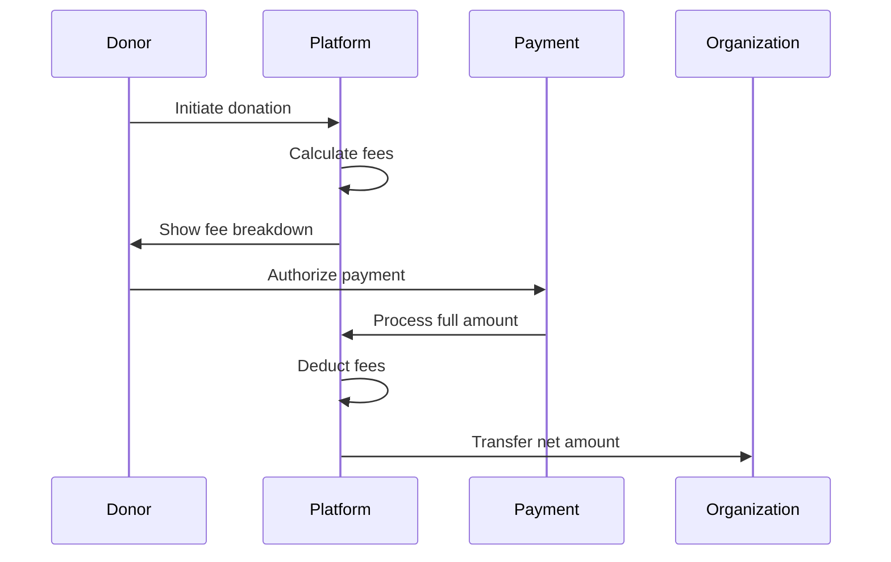

This document provides detailed information about Give Protocol's fee structure, including calculation methods, technical implementation, and integration guidelines for developers.

## Overview

Give Protocol implements a transparent and competitive fee structure designed to maximize the funds reaching charitable organizations while ensuring platform sustainability.

### Fee Philosophy

- **Transparency First**: All fees clearly disclosed
- **Competitive Rates**: Lower than traditional payment processors
- **No Hidden Costs**: What you see is what you pay
- **Value-Based**: Fees reflect the value provided

## Fee Categories

### 1. Platform Fees

**Standard Platform Fee: 2.5%**

- Applied to all donations
- Covers platform operations
- Includes basic features
- No monthly minimums

**Reduced Fee Tiers:**

- **Bronze** (>$10K/month): 2.25%
- **Silver** (>$50K/month): 2.0%
- **Gold** (>$100K/month): 1.75%
- **Platinum** (>$500K/month): 1.5%

### 2. Payment Processing Fees

**Credit/Debit Cards:**

```
Base Rate: 2.9% + $0.30 per transaction
International Cards: +1.5%
Currency Conversion: +1%
```

**Bank Transfers (ACH):**

```
Flat Fee: $0.50 per transaction
No percentage fee
3-5 business day processing
```

**Cryptocurrency:**

```
Network Fees: Variable (paid by sender)
Conversion Fee: 1% (if converting to fiat)
No platform markup on network fees
```

### 3. Additional Service Fees

**Optional Services:**

- **Instant Payouts**: $2.00 per transfer
- **International Wire**: $25.00 per transfer
- **Chargeback Handling**: $15.00 per incident
- **Custom Reporting**: $50.00/month
- **API Premium Access**: $100.00/month

## Fee Calculation

### Standard Donation Example

```javascript
// Donation amount: $100.00
// Payment method: Credit Card
// Organization tier: Standard

const donation = 100.0;
const platformFee = donation * 0.025; // 2.5% = $2.50
const processingFee = donation * 0.029 + 0.3; // 2.9% + $0.30 = $3.20
const totalFees = platformFee + processingFee; // $5.70
const netToCharity = donation - totalFees; // $94.30
```

### Cryptocurrency Donation Example

```javascript
// Donation amount: 0.01 BTC (~$450)
// Conversion to USD requested
// Network fee: Paid by sender

const btcAmount = 0.01;
const usdValue = btcAmount * 45000; // $450
const conversionFee = usdValue * 0.01; // 1% = $4.50
const platformFee = usdValue * 0.025; // 2.5% = $11.25
const totalFees = conversionFee + platformFee; // $15.75
const netToCharity = usdValue - totalFees; // $434.25
```

## Technical Implementation

### Fee Calculation API

**Endpoint:** `POST /api/v1/fees/calculate`

**Request:**

```json
{
  "amount": 100.0,
  "currency": "USD",
  "payment_method": "card",
  "organization_id": "org_123abc",
  "options": {
    "instant_payout": false,
    "convert_crypto": true
  }
}
```

**Response:**

```json
{
  "breakdown": {
    "donation_amount": 100.0,
    "platform_fee": 2.5,
    "processing_fee": 3.2,
    "additional_fees": 0.0,
    "total_fees": 5.7,
    "net_amount": 94.3
  },
  "rates": {
    "platform_rate": 0.025,
    "processing_rate": 0.029,
    "processing_fixed": 0.3
  },
  "organization_tier": "standard"
}
```

### Fee Models

**Database Schema:**

```sql
CREATE TABLE fee_structures (
  id UUID PRIMARY KEY,
  name VARCHAR(50) NOT NULL,
  platform_rate DECIMAL(5,4) NOT NULL,
  min_monthly_volume DECIMAL(10,2),
  max_monthly_volume DECIMAL(10,2),
  created_at TIMESTAMP DEFAULT NOW(),
  updated_at TIMESTAMP DEFAULT NOW()
);

CREATE TABLE transaction_fees (
  id UUID PRIMARY KEY,
  transaction_id UUID REFERENCES transactions(id),
  fee_type VARCHAR(20) NOT NULL,
  amount DECIMAL(10,2) NOT NULL,
  rate DECIMAL(5,4),
  fixed_amount DECIMAL(10,2),
  created_at TIMESTAMP DEFAULT NOW()
);
```

### Fee Collection Flow



## Integration Guide

### SDK Implementation

**JavaScript SDK:**

```javascript
import { GiveProtocol } from "@give-protocol/sdk";

const give = new GiveProtocol({
  apiKey: "your_api_key",
});

// Calculate fees before donation
const feeBreakdown = await give.fees.calculate({
  amount: 100,
  paymentMethod: "card",
  organizationId: "org_123",
});

// Create donation with fee coverage option
const donation = await give.donations.create({
  amount: 100,
  coverFees: true, // Donor covers fees
  organizationId: "org_123",
  paymentMethod: "card",
});
```

**Python SDK:**

```python
from give_protocol import GiveProtocol

give = GiveProtocol(api_key='your_api_key')

# Calculate fees
fee_breakdown = give.fees.calculate(
    amount=100,
    payment_method='card',
    organization_id='org_123'
)

# Create donation
donation = give.donations.create(
    amount=100,
    cover_fees=True,
    organization_id='org_123',
    payment_method='card'
)
```

### Webhook Events

**Fee-Related Events:**

```json
{
  "event": "fee.calculated",
  "data": {
    "donation_id": "don_abc123",
    "amount": 100.0,
    "fees": {
      "platform": 2.5,
      "processing": 3.2,
      "total": 5.7
    }
  }
}
```

## Fee Coverage Options

### Donor Fee Coverage

Organizations can enable donors to cover fees:

```javascript
// Implementation example
const donationWithCoveredFees = {
  baseAmount: 100.0,
  fees: 5.7,
  totalCharge: 105.7,
  netToCharity: 100.0,
};
```

### Organization Absorption

Organizations can choose to absorb fees:

```javascript
// Configuration
{
  "organization_settings": {
    "absorb_platform_fees": true,
    "absorb_processing_fees": false
  }
}
```

## Special Considerations

### Nonprofit Discounts

**Eligibility Requirements:**

- Valid 501(c)(3) status
- Annual revenue under $1M
- Application approval

**Discount Structure:**

- 50% off platform fees
- Reduced to 1.25% base rate
- Same processing fees apply

### High-Volume Processing

**Benefits:**

- Negotiated rates
- Dedicated support
- Custom integration
- Priority processing

**Requirements:**

- Minimum $100K monthly volume
- 6-month commitment
- Annual review

### International Transactions

**Additional Considerations:**

- Currency conversion fees
- Cross-border fees
- Local tax implications
- Regulatory compliance

## Fee Reporting

### Monthly Statements

**Included Information:**

- Transaction-level fee details
- Summary by fee type
- Tier progression tracking
- Year-to-date totals

### API Access

**Reporting Endpoints:**

```
GET /api/v1/fees/report?start_date=2024-01-01&end_date=2024-01-31
GET /api/v1/fees/summary?period=monthly
GET /api/v1/fees/export?format=csv
```

### Tax Documentation

**Available Documents:**

- Fee receipts
- Annual summaries
- 1099-K forms (if applicable)
- Detailed transaction logs

## Optimization Strategies

### Reducing Fees

1. **Increase Monthly Volume**

   - Reach higher tiers
   - Batch processing
   - Consolidated campaigns

2. **Payment Method Selection**

   - Encourage ACH transfers
   - Promote recurring donations
   - Offer crypto options

3. **Timing Strategies**
   - Monthly vs. daily payouts
   - Bulk processing
   - Strategic timing

### Implementation Best Practices

```javascript
// Optimize for lower fees
const optimizeDonation = async (amount, options) => {
  // Check if ACH is available for lower fees
  if (amount > 100 && options.achAvailable) {
    return {
      method: "ach",
      fee: 0.5,
      savingsMessage: "Save $5.20 by using bank transfer",
    };
  }

  // Suggest fee coverage for full donation impact
  if (!options.coveringFees) {
    const fees = calculateFees(amount, "card");
    return {
      suggestion: `Add ${fees} to cover fees?`,
      impact: "Ensure 100% goes to charity",
    };
  }
};
```

## Compliance and Regulations

### PCI Compliance

- Level 1 PCI DSS certified
- Secure fee calculation
- Encrypted transmission
- Regular audits

### Financial Regulations

- FinCEN registered
- State money transmitter licenses
- GDPR compliant
- SOC 2 Type II certified

## Support and Resources

### Developer Resources

- API documentation: `developers.give.io/fees`
- SDK examples: `github.com/give-protocol/examples`
- Integration support: `dev-support@give.io`

### Fee Questions

- General inquiries: `fees@give.io`
- Tier upgrades: `accounts@give.io`
- Technical issues: `support@give.io`

### Additional Resources

- Fee calculator tool
- Integration testing
- Sandbox environment
- Webhook testing
